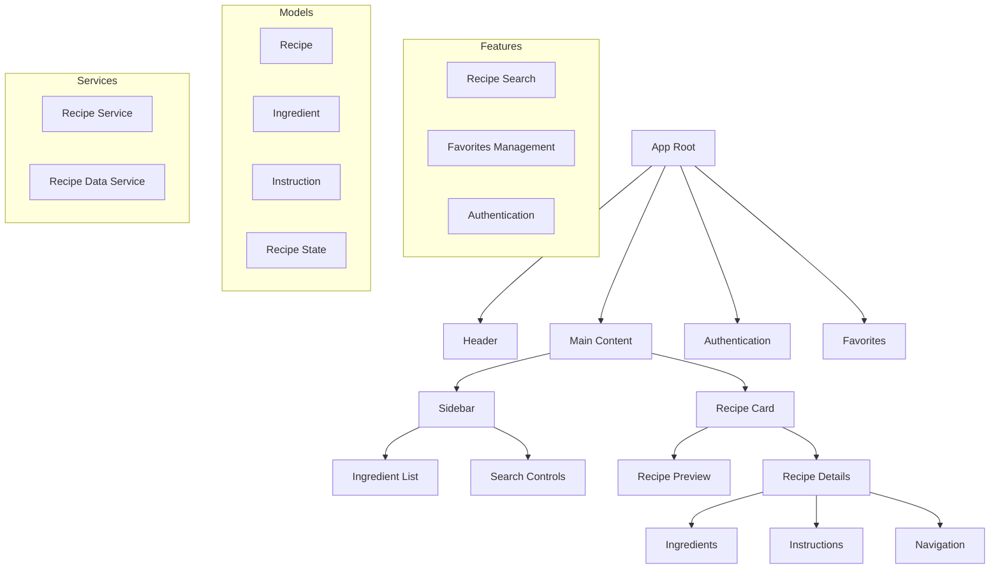

```mermaid
graph TD
    A[App Root] --> B[Header]
    A --> C[Main Content]
    A --> D[Authentication]
    A --> E[Favorites]
    
    C --> F[Sidebar]
    C --> G[Recipe Card]
    
    F --> H[Ingredient List]
    F --> I[Search Controls]
    
    G --> J[Recipe Preview]
    G --> K[Recipe Details]
    
    K --> L[Ingredients]
    K --> M[Instructions]
    K --> N[Navigation]
    
    %% Features
    subgraph Features
        O[Recipe Search]
        P[Favorites Management]
        Q[Authentication]
    end
    
    %% Models
    subgraph Models
        R[Recipe]
        S[Ingredient]
        T[Instruction]
        U[Recipe State]
    end
    
    %% Services
    subgraph Services
        V[Recipe Service]
        W[Recipe Data Service]
    end
```